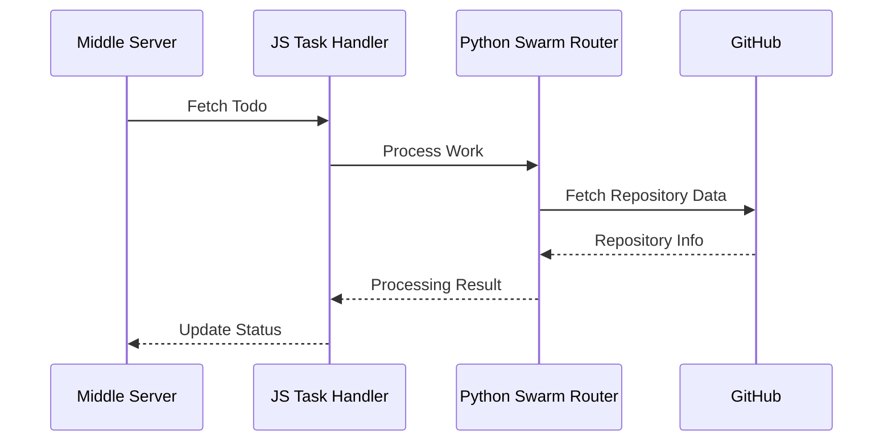
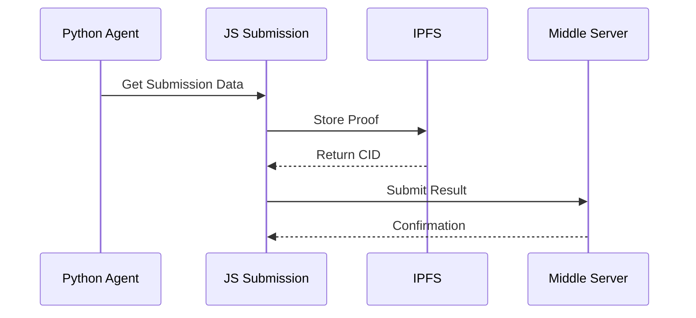
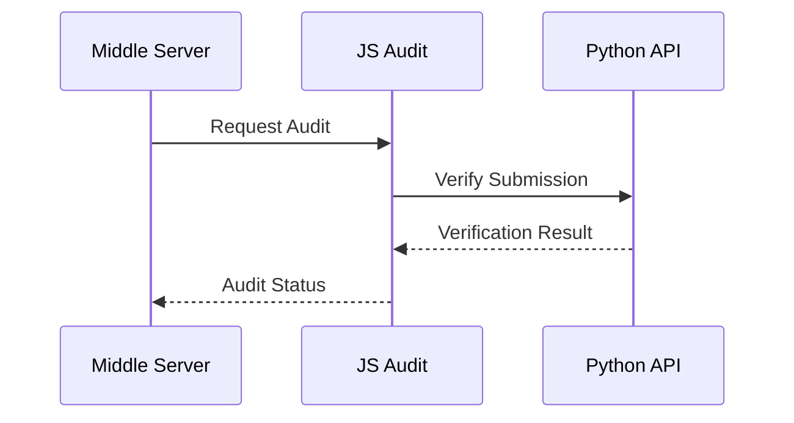

# Modified Swarm Task System

## Overview
This system implements a distributed task processing architecture that coordinates between a middle server, a JavaScript worker layer, and a Python API layer to process and manage swarm-based tasks.

This allows Swarms to run across Koii nodes, with full payments managed in $SWARMS.

## System Architecture

### Components

#### 1. Middle Server
- **Purpose**: Central coordination and task management
- **Key Functions**:
  - Manages todo queue and work item distribution
  - Tracks submission status
  - Handles audit verification
- **Endpoints**:
  - `/summarizer/worker/fetch-todo`: Get new work items
  - `/summarizer/worker/add-todo-status`: Update work item status
  - `/summarizer/worker/add-todo-pr`: Add PR information
  - `/summarizer/worker/add-round-number`: Track round information

#### 2. JavaScript Layer (Worker)
- **Purpose**: Task coordination and submission management
- **Key Components**:
  - Task Handler: Fetches and processes work items
  - Submission Handler: Manages submission process
  - Audit Handler: Handles audit verification
  - Local Storage: Stores temporary data
- **Main Files**:
  - `src/task/1-task.ts`: Task processing logic
  - `src/task/2-submission.ts`: Submission handling
  - `src/task/3-audit.ts`: Audit verification
  - `src/task/5-routes.ts`: API route definitions

#### 3. Python API Layer
- **Purpose**: Core task processing and swarm management
- **Key Components**:
  - FastAPI Server: Main API server
  - Health Check: Monitors API status
  - Swarm Router: Manages swarm operations
  - Agent Handler: Processes individual agent tasks
  - Response Cache: Caches API responses
- **Main Files**:
  - `src/api/api.py`: Core API implementation
  - `main.py`: Server entry point
  - `Dockerfile`: Container configuration

#### 4. External Services
- **IPFS**: Stores submission proofs and verification data
- **GitHub**: Source of repository data and PR management

## Data Flow

### 1. Work Item Processing


### 2. Submission Flow


### 3. Audit Flow


## Work Item Schema

### 1. SwarmSpec Object
```typescript
interface SwarmSpec {
  name?: string;              // Name of the swarm
  description?: string;       // Description of the swarm's purpose
  agents: AgentSpec[];        // Array of agent configurations
  max_loops?: number;         // Maximum iteration loops (default: 1)
  swarm_type?: string;        // Type of workflow
  rearrange_flow?: string;    // Instructions to rearrange workflow
  task: string;              // The task to be performed
  img?: string;              // Optional image URL
  return_history?: boolean;   // Include conversation history (default: true)
  rules?: string;            // Guidelines for agent behavior
  schedule?: ScheduleSpec;    // Scheduling details (for scheduled jobs)
}
```

### 2. AgentSpec Object
```typescript
interface AgentSpec {
  agent_name: string;         // Name of the agent
  description?: string;       // Agent's purpose description
  system_prompt?: string;     // System prompt for the agent
  model_name: string;         // AI model to use (e.g., "gpt-4o", "claude-3-opus")
  auto_generate_prompt?: boolean; // Generate prompts automatically
  max_tokens?: number;        // Maximum tokens for responses (default: 8192)
  temperature?: number;       // Response randomness (default: 0.5)
  role?: string;             // Agent's role (default: "worker")
  max_loops?: number;        // Maximum loops for this agent (default: 1)
}
```

### 3. ScheduleSpec Object
```typescript
interface ScheduleSpec {
  scheduled_time: string;     // When to execute the task (in UTC)
  timezone?: string;         // Timezone for scheduling (default: "UTC")
}
```

### 4. Supported Swarm Types
- `AgentRearrange`
- `MixtureOfAgents`
- `SpreadSheetSwarm`
- `SequentialWorkflow`
- `ConcurrentWorkflow`
- `GroupChat`
- `MultiAgentRouter`
- `AutoSwarmBuilder`
- `HiearchicalSwarm`
- `auto`
- `MajorityVoting`

### 5. Example Work Item
```json
{
  "name": "Financial Analysis Swarm",
  "description": "Market analysis swarm",
  "agents": [
    {
      "agent_name": "Market Analyst",
      "description": "Analyzes market trends",
      "system_prompt": "You are a financial analyst expert.",
      "model_name": "gpt-4o",
      "role": "worker",
      "max_loops": 1,
      "max_tokens": 8192,
      "temperature": 0.5
    }
  ],
  "max_loops": 1,
  "swarm_type": "ConcurrentWorkflow",
  "task": "Analyze market trends for AI and tech sectors",
  "return_history": true
}
```

## Security Features

1. **Authentication**
   - API key verification
   - Signature validation
   - Staking key verification

2. **Rate Limiting**
   - Request throttling
   - Concurrent request limits
   - Timeout handling

3. **Error Handling**
   - Retry mechanisms
   - Graceful degradation
   - Comprehensive logging

## Setup and Installation

### Prerequisites
- Node.js (v16+)
- Python 3.11+
- Docker
- IPFS node
- GitHub account with appropriate permissions

### Environment Variables
```env
MIDDLE_SERVER_URL=https://builder247-prod.dev.koii.network
TASK_ID=your_task_id
GITHUB_USERNAME=your_github_username
```

### Installation Steps

1. **JavaScript Layer**
```bash
cd worker
npm install
```

2. **Python API Layer**
```bash
cd worker/orca-agent
python -m venv venv
source venv/bin/activate
pip install -r requirements.txt
```

3. **Docker Setup**
```bash
cd worker/orca-agent
docker build -t orca-agent .
```

## Running the System

1. **Start Python API**
```bash
cd worker/orca-agent
docker run -p 8080:8080 orca-agent
```

2. **Start JavaScript Worker**
```bash
cd worker
npm start
```

## Monitoring and Maintenance

### Health Checks
- API health endpoint: `GET /healthz/`
- Worker status: `GET /health`
- Middle server status: Check logs

### Logging
- Python API logs: `api.log`
- Worker logs: Console output
- Docker logs: `docker logs <container_id>`

## Error Handling

The system implements comprehensive error handling:
1. Automatic retries for failed API calls
2. Graceful degradation during service outages
3. Detailed error logging and monitoring
4. Fallback mechanisms for critical operations

## Contributing

1. Fork the repository
2. Create a feature branch
3. Commit your changes
4. Push to the branch
5. Create a Pull Request

## License

[Add your license information here]