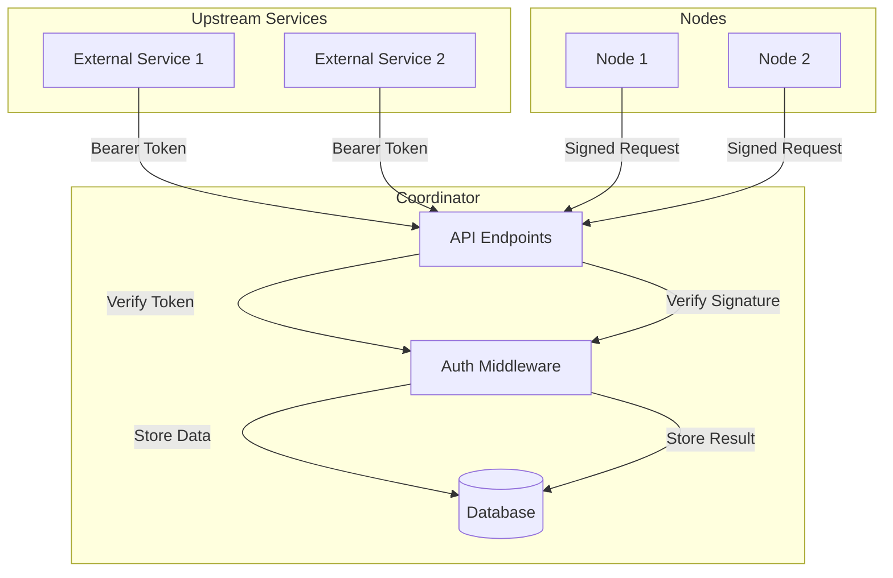

# Middle Server

A monorepo containing the Middle Server service for Swarm Task Processing on the Koii Network.

## Project Structure

- `middle-server/`: The main server component for Swarm APIs
- `node/`: Contains the task implementation that integrates with Swarms API

## Architecture

The system consists of three main components:

1. **Middle Server**: Coordinates tasks and manages the workflow
2. **Task Node**: Executes tasks using the Swarms API
3. **Swarms API**: Provides AI agent swarm capabilities

### Integration Flow

1. Middle Server receives task requests
2. Task Node fetches tasks from Middle Server
3. Task Node executes tasks using Swarms API
4. Results are stored and returned to Middle Server

## Prerequisites

- Node.js (v18+ recommended)
- npm
- Docker and Docker Compose
- Swarms API access and API key

## Environment Variables

Required environment variables:
```bash
SWARMS_API_URL=http://localhost:8080  # Swarms API endpoint
SWARMS_API_KEY=your_api_key          # Swarms API key
MIDDLE_SERVER_URL=http://localhost:3000  # Middle server endpoint
```

## Getting Started

1. Clone the repository:
   ```bash
   git clone <repository-url>
   cd coordinator
   ```

2. Install dependencies:
   ```bash
   npm install
   cd middle-server
   npm install
   ```

3. Set up environment variables:
   ```bash
   cp .env.example .env
   # Edit .env with your configuration
   ```

4. Start the services:
   ```bash
   docker-compose up -d
   ```

5. Start the middle server:
   ```bash
   cd middle-server
   npm run dev
   ```

## API Endpoints

### Middle Server Endpoints
- `/summarizer/worker/get-task` - Get task for execution
- `/summarizer/worker/add-todo-pr` - Add PR to todo list
- `/summarizer/worker/update-audit-result` - Update audit results

### Task Node Endpoints
- `/task/:roundNumber` - Execute task for a round
- `/swarm-status/:jobId` - Check swarm execution status
- `/available-models` - Get available AI models
- `/available-swarm-types` - Get available swarm types

## Swarms Integration

The task node integrates with the Swarms API to:
1. Execute AI agent swarms
2. Monitor swarm execution
3. Retrieve results
4. Handle errors and retries

## Test Scripts

Live API test scripts are available in `

# Coordinator

The coordinator manages communication between nodes and external services, handling both upstream (external) and downstream (node) API requests.

## Architecture

The coordinator implements a pull-based architecture where upstream services initiate communication through REST API endpoints.



### Communication Patterns

1. **Upstream Communication (Pull Model)**
   - External services push data to the coordinator
   - Authentication via `SWARMS_ADMIN_KEY` bearer token
   - Available endpoints:
     ```
     POST /api/swarm/jobs          - Create new swarm jobs
     GET  /api/swarm/jobs/:jobId   - Get job status
     PUT  /api/swarm/jobs/:jobId/status  - Update job status
     POST /api/swarm/jobs/:jobId/result  - Store results
     GET  /api/swarm/jobs/:jobId/result  - Get results
     ```
   - No active polling or fetching from upstream services
   - Coordinator waits for upstream services to push data

2. **Downstream Communication**
   - Nodes authenticate using public key cryptography
   - Each request must be signed with the node's private key
   - Required headers:
     ```
     Authorization: Bearer <SWARMS_ADMIN_KEY>
     X-Signature: <base58-encoded-signature>
     X-Public-Key: <base58-encoded-public-key>
     ```

## Authentication

The coordinator implements two distinct authentication methods:

### 1. Upstream Authentication (External Services)

External services authenticate using a bearer token mechanism:

```typescript
// Example request
const response = await axios.post(
  "http://localhost:3000/api/swarm/jobs",
  payload,
  {
    headers: {
      "Authorization": `Bearer ${process.env.SWARMS_ADMIN_KEY}`,
      "Content-Type": "application/json"
    }
  }
);
```

**Configuration:**
- Set the `SWARMS_ADMIN_KEY` environment variable with a secure key
- This key is used to authenticate all upstream API requests
- Requests without a valid bearer token will receive a 401 Unauthorized response

### 2. Downstream Authentication (Nodes)

Nodes authenticate using public key cryptography:

1. **Key Generation:**
   ```typescript
   const keypair = Keypair.generate();
   const publicKey = keypair.publicKey.toBase58();
   ```

2. **Request Signing:**
   ```typescript
   const payload = {
     taskId: "task-123",
     timestamp: Date.now(),
     action: "create_swarm"
   };
   const signature = await signData(keypair, payload);
   ```

3. **Making Authenticated Requests:**
   ```typescript
   const response = await axios.post(
     "http://localhost:3000/api/swarm/jobs",
     payload,
     {
       headers: {
         "Authorization": `Bearer ${process.env.SWARMS_ADMIN_KEY}`,
         "X-Signature": signature,
         "X-Public-Key": publicKey,
         "Content-Type": "application/json"
       }
     }
   );
   ```

**Required Headers:**
- `Authorization`: Bearer token for upstream authentication
- `X-Signature`: Base58-encoded signature of the request payload
- `X-Public-Key`: Base58-encoded public key of the node

**Security:**
- Each request must be signed with the node's private key
- The signature is verified using the provided public key
- Invalid signatures result in 401 Unauthorized responses
- The payload must include a timestamp to prevent replay attacks

## Example Usage

See `scripts/auth-example.ts` for a complete example of making authenticated requests:

```typescript
// Generate keypair
const keypair = Keypair.generate();

// Create and sign payload
const payload = {
  taskId: "example-task-123",
  timestamp: Date.now(),
  action: "create_swarm"
};
const signature = await signData(keypair, payload);

// Make authenticated request
const response = await axios.post(
  "http://localhost:3000/api/swarm/jobs",
  payload,
  {
    headers: {
      "Authorization": `Bearer ${process.env.SWARMS_ADMIN_KEY}`,
      "X-Signature": signature,
      "X-Public-Key": keypair.publicKey.toBase58()
    }
  }
);
```

## Testing

The authentication system is tested in:
- `src/tests/auth.test.ts`: General authentication tests
- `src/tests/downstream-auth.test.ts`: Downstream API authentication tests

Run tests with:
```bash
npm test
```